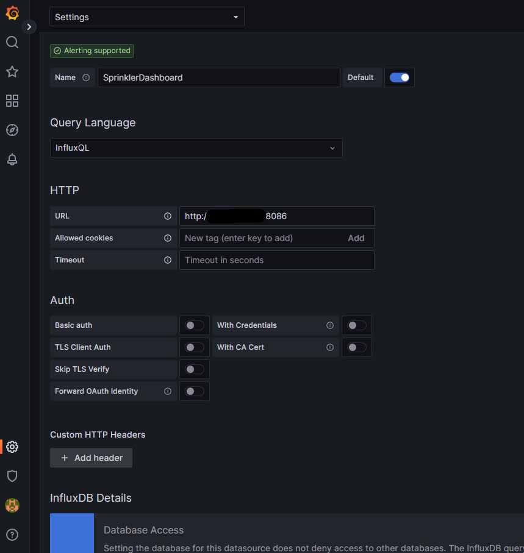
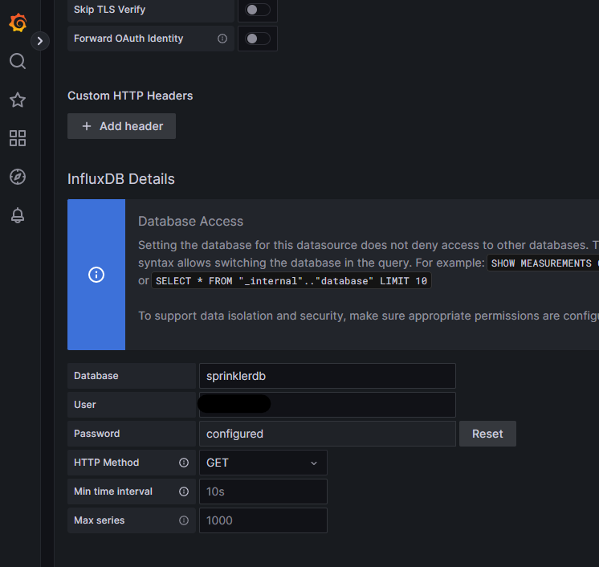
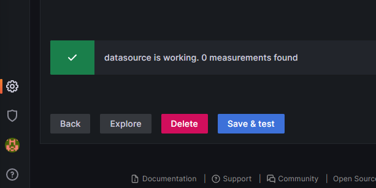

# Raspberry Pi 2 set up

These are the steps that have been done in order to set up Raspberry Pi 2

# Installation 

From a new Raspberry Pi 2 image flashed the following commands where executed:

## Update 

```
$ sudo apt update
$ sudo apt upgrade -y
```

## Install Influxdb

Add Influx repositories to apt:

```
$ wget -qO- https://repos.influxdata.com/influxdb.key | sudo apt-key add -
source /etc/os-release
echo "deb https://repos.influxdata.com/debian $(lsb_release -cs) stable" | sudo tee /etc/apt/sources.list.d/influxdb.list
```

Update apt with the new repos, & install.

```
$ sudo apt update && sudo apt install -y influxdb
```

Then start the influxdb service and set it to run at boot:

```
$ sudo systemctl unmask influxdb.service
$ sudo systemctl start influxdb
$ sudo systemctl enable influxdb.service
```

### Troubleshooting - missing key

In case an error occurs during the installation of influxdb due to the key like:

```
$ sudo apt update && sudo apt install -y influxdb
Get:1 http://archive.raspberrypi.org/debian bullseye InRelease [23.6 kB]
Get:2 http://raspbian.raspberrypi.org/raspbian bullseye InRelease [15.0 kB]
Get:3 https://repos.influxdata.com/debian bullseye InRelease [7031 B]
Get:4 http://archive.raspberrypi.org/debian bullseye/main armhf Packages [316 kB]
Err:3 https://repos.influxdata.com/debian bullseye InRelease
  The following signatures couldn't be verified because the public key is not available: NO_PUBKEY D8FF8E1F7DF8B07E
Get:5 http://raspbian.raspberrypi.org/raspbian bullseye/main armhf Packages [13.2 MB]
Reading package lists... Done
W: GPG error: https://repos.influxdata.com/debian bullseye InRelease: The following signatures couldn't be verified because the public key is not available: NO_PUBKEY D8FF8E1F7DF8B07E
E: The repository 'https://repos.influxdata.com/debian bullseye InRelease' is not signed.
N: Updating from such a repository can't be done securely, and is therefore disabled by default.
N: See apt-secure(8) manpage for repository creation and user configuration details.
```

A solution is available at [Configuring Linux hosts to use the new signing key](https://www.influxdata.com/blog/linux-package-signing-key-rotation/).

Step 1 - Obtain and verify the new key

```
$ wget -q https://repos.influxdata.com/influxdata-archive_compat.key
$ gpg --with-fingerprint --show-keys ./influxdata-archive_compat.key
```

Step 2 - Install the new key

```
$ cat influxdata-archive_compat.key | gpg --dearmor | sudo tee /etc/apt/trusted.gpg.d/influxdata-archive_compat.gpg > /dev/null
```

Step 3 - Update your APT sources to use the new key

```
echo 'deb [signed-by=/etc/apt/trusted.gpg.d/influxdata-archive_compat.gpg] https://repos.influxdata.com/debian stable main' | sudo tee /etc/apt/sources.list.d/influxdata.list
```

Step 4 - Cleanup the old key

```
sudo rm -f /etc/apt/trusted.gpg.d/influxdb.gpg
```

Step 5 - check that no errors on update and then install influxdb

```
sudo apt update && sudo apt install -y influxdb
```

## Create db and User

Connect to influxdb

```
$ influx
Connected to http://localhost:8086 version 1.8.10
InfluxDB shell version: 1.8.10
>
```

Create DB

```
> create database sprinklerdb
> use sprinklerdb
Using database sprinklerdb
```

Create user

```
> create user <user_name> with password 'password_to_be_used' with all privileges
> grant all privileges on sprinklerdb to <user_name>
```

Show the user for confirmation

```
> show users
```

### Troubleshooting - Missing locale during influxdb installation

If during the influxdb installation you get:

```
$ sudo apt update && sudo apt install -y influxdb
...
Get:1 https://repos.influxdata.com/debian stable/main armhf influxdb armhf 1.8.10-1 [50.7 MB]
Fetched 50.7 MB in 23s (2188 kB/s)
apt-listchanges: Can't set locale; make sure $LC_* and $LANG are correct!
perl: warning: Setting locale failed.
perl: warning: Please check that your locale settings:
        LANGUAGE = (unset),
        LC_ALL = (unset),
        LANG = "en_GB.UTF-8"
    are supported and installed on your system.
perl: warning: Falling back to the standard locale ("C").
locale: Cannot set LC_CTYPE to default locale: No such file or directory
locale: Cannot set LC_MESSAGES to default locale: No such file or directory
locale: Cannot set LC_ALL to default locale: No such file or directory
...
```

You can fix this issue by:

Step 1 - export variables

```
$ export LANGUAGE=en_GB.UTF-8
$ export LC_ALL=en_GB.UTF-8
```

Step 2- Check that the default settings are uncommented

```
$ sudo nano /etc/locale.gen
```

Step 3 - Generate again the locale

```
$ sudo locale-gen
```

## Install Grafana

We need to add the Grafana packages to apt

```
wget -q -O - https://packages.grafana.com/gpg.key | sudo apt-key add -
echo "deb https://packages.grafana.com/oss/deb stable main" | sudo tee /etc/apt/sources.list.d/grafana.list
```

We can now update and install the binaries

```
sudo apt update && sudo apt install -y grafana
```

Then simply enable the service and set to run at boot:

```
$ sudo systemctl unmask grafana-server.service
$ sudo systemctl start grafana-server
$ sudo systemctl enable grafana-server.service
Synchronizing state of grafana-server.service with SysV service script with /lib/systemd/systemd-sysv-install.
Executing: /lib/systemd/systemd-sysv-install enable grafana-server
Created symlink /etc/systemd/system/multi-user.target.wants/grafana-server.service → /lib/systemd/system/grafana-server.service.
```

Now we can check that grafana is up by loading it in a browser: http://\<ipaddress>:3000. If so, you can log in with the username and password = admin and set a new admin password.

## Add InfluxDB as Data source

Now we have both Influx and Grafana running, we can stitch them together. Log in to your Grafana instance and head to "Data Sources". Select "Add new Data Source" and find InfluxDB under "Timeseries Databases".

As we are running both services on the same Pi, set the URL to localhost and use the default influx port of 8086:



We then need to add the database, user and password that we set earlier:



That's all we need! Now go ahead and hit "Save & Test" to connect everything together:




## Install Mosquitto MQTT Broker

Install Mosquitto Broker
```
$ sudo apt install -y mosquitto mosquitto-clients
```

Make Mosquitto auto start at the boot

```
$ sudo systemctl enable mosquitto.service
```

It is possible to test the mosquitto execution via:

```
$ mosquitto -v
1681414725: mosquitto version 2.0.11 starting
1681414725: Using default config.
1681414725: Starting in local only mode. Connections will only be possible from clients running on this machine.
1681414725: Create a configuration file which defines a listener to allow remote access.
1681414725: For more details see https://mosquitto.org/documentation/authentication-methods/
1681414725: Opening ipv4 listen socket on port 1883.
1681414725: Error: Address already in use
1681414725: Opening ipv6 listen socket on port 1883.
1681414725: Error: Address already in use
```

### Enable Remote Access with authentication

```
$ sudo mosquitto_passwd -c /etc/mosquitto/passwd YOUR_USERNAME
```

Enter the password when asked.

This previous command creates a password file called passwd on the /etc/mosquitto directory.

Edit the configuration file:

```
sudo nano /etc/mosquitto/mosquitto.conf
```

Add the following line at the top of the file (make sure it is at the top of the file, otherwise it won’t work):

```
per_listener_settings true
```

Add the following three lines to allow connection for authenticated users and tell Mosquitto where the username/password file is located

```
allow_anonymous false
listener 1883
password_file /etc/mosquitto/passwd
```

Restart Mosquitto for the changes to take effect.

```
sudo systemctl restart mosquitto
```

To check if Mosquitto is actually running, you can run the following command:

```
sudo systemctl status mosquitto
```

### Add More Users/Change Password

To add more users to an existing password file, or to change the password for an existing user, leave out the -c argument:

```
mosquitto_passwd <password file> <username>
```

For example, if I want to change the password for the sara user and taking into account that the password file we created was called passwd, the command will be as follows:

```
sudo mosquitto_passwd /etc/mosquitto/passwd sara
```